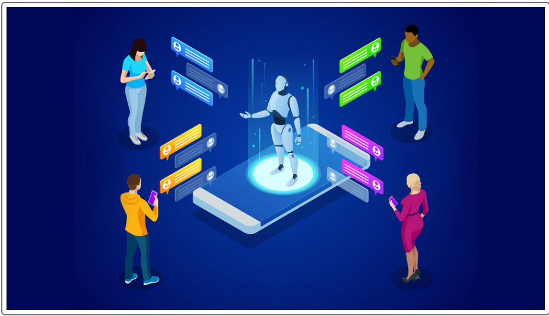

# M15-Robo_Advisor

 

*"Creating a Robo-advisor to improve customer experience for retirement investment portfolio recomendations."* 

## Background

As a digital transformation consultant, this project creates a Robo-advisor to improve customer experience and give investment recommendations for a prominent retirement plan provider. Seeking to target a younger generation to increase their client accounts, the latest technology is utilized in machine learning(ML) and natural language processing(NLP) to improve customer experience. Initiatives are taken to make improvements to meet a broader target market by adapting the latest technology. 
The plan is to utilize AWS technology to deploy the robo-Advisor and CUI to offer 24/7 communication over a secure cloud network. Managing AWS technology offers the retirement firm cost savings in personnel, energy costs, and efficiencies to improve technological resources on a timely basis.  
The FinTech technology in this program utilizes CUI Amazon Lex to establish conversation and Amazon Lambda to validate input conversation and returns investment recommendations. 


---

## Evaluation Results
The following evaluation describes the performance test of the Robo-advisor in the following animation as a sample.  To analyze and conclude that Amazon Lex and Lambda are operating properly, valid and invalid utterances are used during CUI testing for evaluation.   


---

## Technologies

The software operates on python 3.7 with the installation package imports embedded with Anaconda3 installation. JASON import is required for Lambda to interface with other AWS service functions. From dateutil.relativedelta and botocore.vendored bring imported libraries for additional imported tools this program utilizes to affix with Amazon Lex, S3, AWS Lambda to function in this application. Together they function as application tools that you need for this module to construct Robo-advisor on AWS for 24/7 on demand cloud computing service.  


---

## Installation Guide

Before running the applications open an AWS account which is needed before starting work on Robo-advisor bot installations. Please reference AWS instructions on the official web site below and activate it to get started. 

It is important to read carefully and follow the 4-step process on creating an AWS Account: 

    1) Create your account; 

    2) Add a payment method; 

    3) Verify your phone number; 

    4) Choose an AWS support plan 


* [python](https://www.python.org/downloads/)

* [anaconda3](https://docs.anaconda.com/anaconda/install/windows/e) 

* [Create an AWSAccount](https://aws.amazon.com/what-is-aws/)

```python libraries

```
``` 
import json 				                        #  required for Lambda to interact with other AWS services
from datetime import datetime
from dateutil.relativedelta import relativedelta	# provides up-to-date computations in world time zones
from botocore.vendored import request 	            # for the cryptocurrency API
Amazon Lex					                        # for creating and testing CUIs
Amazon S3					                        # for storing files in the cloud 
AWS Lambda					                        # for creating serverless applications 
Amazon SageMaker:				                    # for deploying machine learning models 
```


---
# Usage
    

The program is developed in Jupyter notebook on a jupyter **.ipny** file. AWS Management Console makes it possible to utilize Amazon Lex, S3 and AWS Lambda to create the Robo-advisor bot. The program applies CUI to process NLP between client and the bot using utterances to interact and give investment advice. Once client’s intent is fulfilled the Robo-advisor responds with investment recommendations for retirement with the appropriate risk level. 
 


 
 


``````
python
lambda_function.py

```
